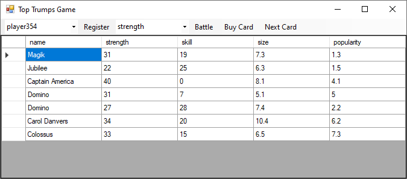

# Top Trumps Card Game

This example shows how to implement a client for the [Top Trumps RESTful service](https://app.swaggerhub.com/apis-docs/gorbounoff/top-trupms/0.1) and create a Windows Forms application that uses the client.

